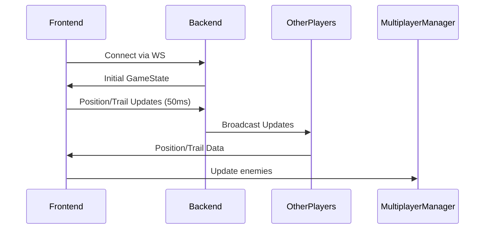

# Multiplayer Architecture

## Core Components

### Backend (Python/FastAPI)
- `WebSocketHandler`: Manages real-time connections
- `GameState`: Tracks player positions/trails
- `BroadcastManager`: Efficiently sends updates to all players

### Frontend (React/Three.js)
- `MultiplayerManager`: 
  - `addPlayer()`: Creates remote player instances
  - `updatePlayerPosition()`: Smooth position interpolation
  - `syncTrails()`: Updates enemy light trails

## Data Flow

## Critical Methods

| Component          | Method                 | Description                                  |
|--------------------|------------------------|----------------------------------------------|
| `MultiplayerManager` | update()             | Main game loop handler (33Hz updates)        |
| `GameState`          | get_compressed_state() | Optimized network payload formatter         |
| `LightCycle`         | serialize_trail()     | Converts trail geometry to network format   | 